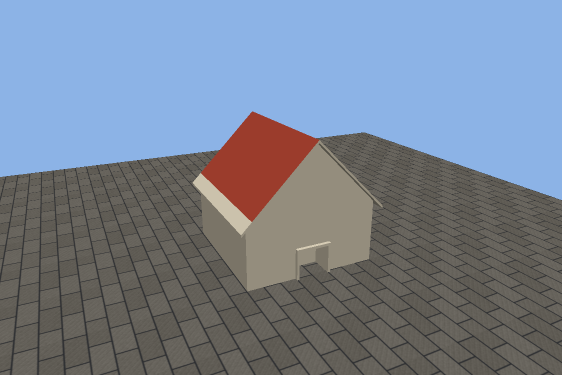
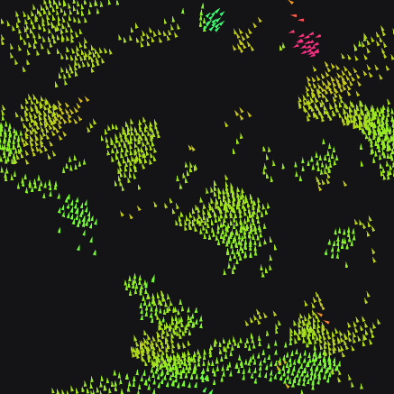
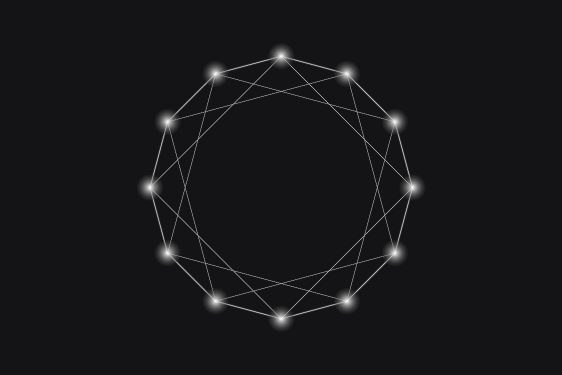
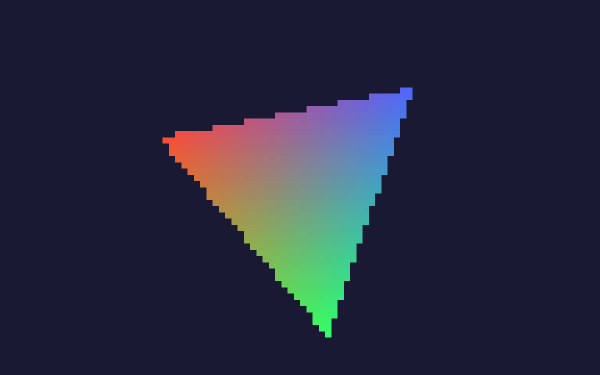

# WebGPU Lab
wgpu-lab is a library designed for rapid prototyping of native WebGPU applications in C++.
Its main goal is to provide convenient wrappers and intuitive tools for working with
[WebGPU Dawn](https://dawn.googlesource.com/dawn),
minimizing boilerplate code while remaining flexible and customizable.

I’m developing this library in my free time as I learn the fundamentals of WebGPU.
My hope is that it will serve the open source community as a useful resource for learning
and as a foundation for building creative projects.

Please note that wgpu-lab is in an early, heavily experimental stage,
and the API is likely to undergo significant changes.

**Contributions are welcome!**

<p>
  
  
  
  
</p>

All of these are [samples](#samples) of a hundred lines or so.


## Simple Usage Sample
```c++
#include <lab>

#include <vector>

using enum wgpu::VertexFormat;

struct MyVertex {
  float pos[2];
  float color[3];
};

int main() {
  lab::Gpu gpu;
  lab::Window window("Hello Triangle", 640, 400);
  lab::Surface surface(gpu, window);

  // colored triangle data
  std::vector<MyVertex> vertex_data = {
      //         X      Y                R     G     B
      {.pos = {-0.5f, -0.5f}, .color = {0.8f, 0.2f, 0.2f}},
      {.pos = {+0.5f, -0.5f}, .color = {0.8f, 0.8f, 0.2f}},
      {.pos = {+0.0f, +0.5f}, .color = {0.2f, 0.8f, 0.4f}},
  };

  // vertex buffer (sends a copy of the data to GPU memory)
  lab::Buffer vertices(gpu, vertex_data);

  lab::Shader shader(gpu, "shaders/03_vertex_buffer.wgsl");

  // the pipeline needs to know how a vertex is laid out in memory:
  // two floats for @location(0) position, three floats for @location(1) color
  lab::Pipeline pipeline(gpu, shader,
                         {.vertex_buffers = {lab::vertex<MyVertex>({Float32x2, Float32x3})}, .target = surface});

  // main application loop
  while (lab::tick()) {
    pipeline.render_frame(surface, {.vertex_buffers = {vertices}}); // draws all 3 vertices of the buffer
  }
}
```

`render_frame()` is the short form for a frame with a single draw call.
With a `lab::RenderPass`, any number of pipelines draw into the same frame:

```c++
  while (lab::tick()) {
    lab::RenderPass pass(surface);         // a pass onto the window, it is one frame
    pass.draw(edge_pipeline, draw_edges);  // a lab::Draw names the buffers and bind groups to use
    pass.draw(node_pipeline, draw_nodes);
  }                                        // the pass ends here: the frame is submitted and shown
```

The lab never stands between you and WebGPU: `wgpu::` types are used as they are,
and every lab object hands out the WebGPU object it wraps through `handle()`.

Mistakes are reported where they are made, as a `lab::Error` that names the object:

```
pipeline(03_vertex_buffer.wgsl): draw: vertex buffer 0 has elements of 4 bytes, but the pipeline
declares 20 bytes for it: is it the buffer the layout was written for?
```


## Samples

The samples in `samples/` build on each other, one concept at a time:

| Sample | Shows |
|---|---|
| `01_window` | a window and keyboard input, no GPU involved yet |
| `02_triangle` | the smallest program that renders something, pipeline settings |
| `03_vertex_buffer` | vertices from a buffer (the example above) |
| `04_uniforms` | a uniform buffer and a bind group, animation |
| `05_texture` | a texture filled with pixels, read through a sampler |
| `06_instancing` | one mesh drawn many times, live updates, keyboard control |
| `07_graph` | several pipelines in one render pass, indexed drawing |
| `08_readback` | getting data back from the GPU, without a window |
| `09_multi_window` | one GPU rendering into several windows |
| `10_house` | a 3D scene: depth buffer, camera, lighting, a glTF model and an image file |
| `11_boids` | a compute shader simulates a flock that is drawn in the same frame |
| `12_offscreen` | rendering into a texture and using it in a second pass |


## Getting Started

You need a C++23 compiler, [CMake](https://cmake.org/) 3.28 or newer,
[Ninja](https://ninja-build.org/) and git.

```sh
git clone https://github.com/bv7dev/wgpu-lab.git
cd wgpu-lab
cmake --preset dev
cmake --build --preset dev
```

The first `cmake --preset dev` downloads a prebuilt Dawn (about 40 MB on Linux),
so there is no long Dawn build to wait for.

**Run sample executables:**

The samples end up at the top of the build directory, next to the shaders they load:

```sh
cd build/dev
./03_vertex_buffer
```

For VS Code users, there's a shared `.vscode/launch.json` configuration file.
This setup allows you to build and run any `.cpp` source file that's located in the `samples/` directory,
simply by opening it in the editor and pressing `F5`. This runs the code in debug mode (set breakpoints and step through the code to learn how it works).

To get started, you can add your own `.cpp` file, tinker around and step through the code. Use CMake Tools to reconfigure the project after adding new files.

**Run the tests:**

```sh
ctest --preset dev              # everything; each sample opens its window for a second
ctest --preset dev -LE display  # only the tests that need no window (they render into textures)
```

A few environment variables help with running and inspecting programs:

| Variable | Effect |
|---|---|
| `LAB_EXIT_AFTER_FRAMES=120` | all windows close after 120 frames |
| `LAB_CAPTURE_DIR=shots` | every window saves one frame as `shots/<program>.png` (frame 30, or `LAB_CAPTURE_FRAME`) |
| `LAB_LOG=debug` | more output (`debug`, `info`, `warn`, `error` or `off`) |
| `LAB_WINDOW_SYSTEM=x11` | on Linux: use X11 (through XWayland) or `wayland`, instead of what GLFW picks |

### Linux

Wayland and X11 are both supported. If GLFW 3.4 or newer is installed
(`glfw` on Arch, `libglfw3-dev` on recent Debian/Ubuntu) it is used, otherwise GLFW is built
from source and needs its build dependencies, for example on Debian/Ubuntu:

```sh
sudo apt install libwayland-dev libxkbcommon-dev xorg-dev
```

### Windows

Install [Visual Studio](https://visualstudio.microsoft.com/vs/community/) with the
"Desktop development with C++" workload (it includes MSVC, CMake and Ninja) and run the
commands above from a "Developer PowerShell for VS".
Alternatively, open the folder in [VS Code](https://code.visualstudio.com/) with the
recommended extensions and pick the `dev` preset.

### Web

The same programs run in a browser, through its WebGPU. With
[Emscripten](https://emscripten.org/) installed (`emcc` on the PATH):

```sh
emcmake cmake --preset web
cmake --build --preset web
cd build/web/site && python -m http.server 8000   # then open http://localhost:8000/
```

`build/web/site/` holds one page per sample and an index page, which is what the
GitHub Pages workflow publishes. The `while (lab::tick())` loop stays as it is: on the
web, `tick()` hands control back to the browser until the next frame.

### Mac (help wanted)

### Choosing where Dawn comes from

| `-DLAB_DAWN=` | What happens |
|---|---|
| `prebuilt` (default) | downloads the release archive that Dawn's CI publishes for the pinned version |
| `source` | fetches and builds Dawn itself (takes a while, needs Python for Dawn's build scripts) |
| `system` | uses a Dawn you installed yourself, found through `find_package(Dawn)` |

The pinned Dawn version is set at the top of `cmake/LabDawn.cmake`. The web build uses
Dawn's Emscripten port of the same release (`cmake/emdawnwebgpu.remoteport.py`).

### Dependencies
The library only depends on [WebGPU Dawn](https://dawn.googlesource.com/dawn) and
[GLFW](https://www.glfw.org/) for windowing.
Some of the samples use [GLM](https://github.com/g-truc/glm) for vector math and
[tinygltf](https://github.com/syoyo/tinygltf) to read a model, and the tests use
[doctest](https://github.com/doctest/doctest). These are downloaded when samples and tests
are built, which is only the case when wgpu-lab is the top-level project.


## Roadmap
- [x] address build system issues
- [x] re-design render pipeline
- [x] replace render_frame() function by smaller, composable mechanisms
- [x] write tests
- [x] add depth buffers, samplers and a 3D sample
- [x] add compute pipeline support
- [x] add emscripten support for WebAssembly
- [ ] unify and finalize lab API
- [ ] write documentation
- [ ] release stable 1.0 version

Coming from version 0.2? See [docs/migrating-from-0.2.md](docs/migrating-from-0.2.md).
